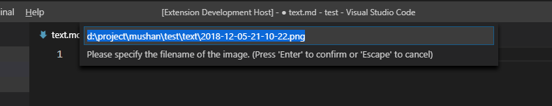

# 开发环境的搭建
## 安装vscode
### alt + ctrl + v


# 快捷键

1. 注释 ctrl+/
2. 多选 ctrl+d
3. 随时换下一行 ctrl+换行
4. 前面加一行 ctrl+shift+换行
5. 多个标签生成 x*6（复制几个）+tab
6. 浏览器中ctrl+click（点击）可以打开一个新窗口

```html
h1*6
h1*6>{一级标题}
h$*6>{$级标题}
```
6. 缩进 tab 减缩进 shift+tab

7. 官方文档mdn

